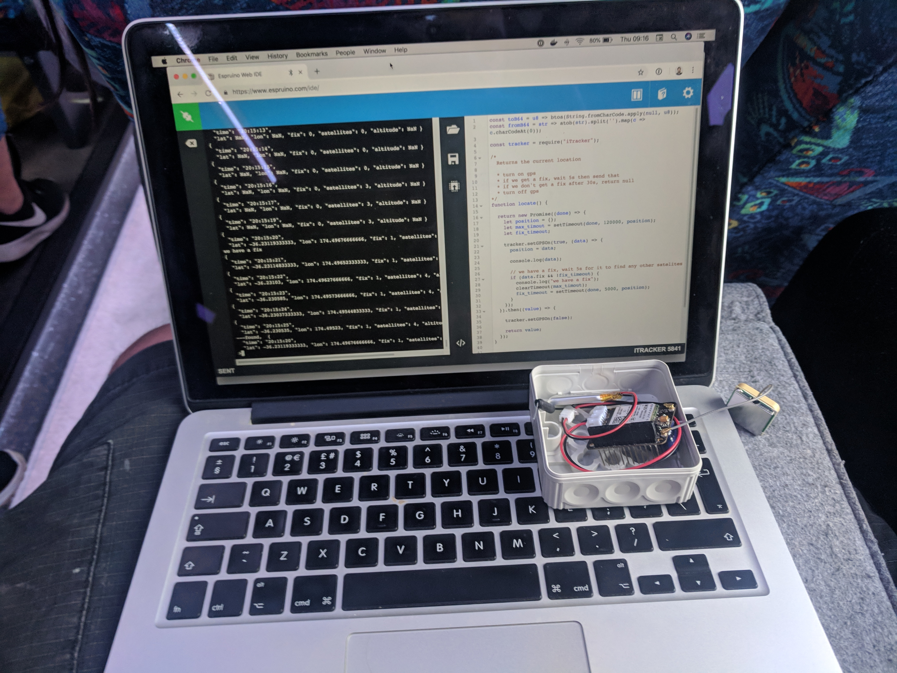
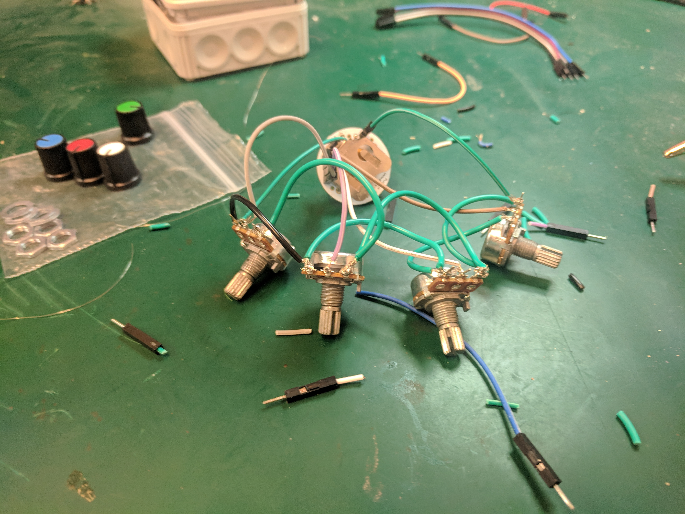
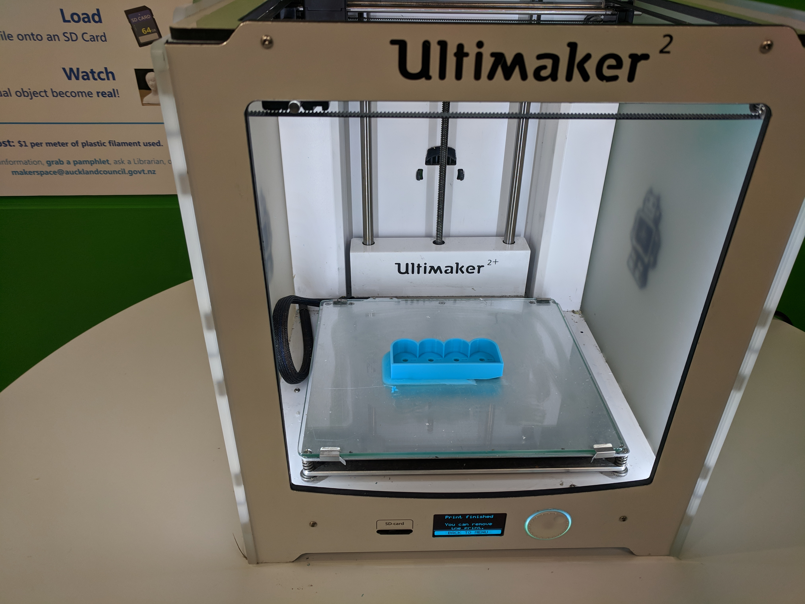
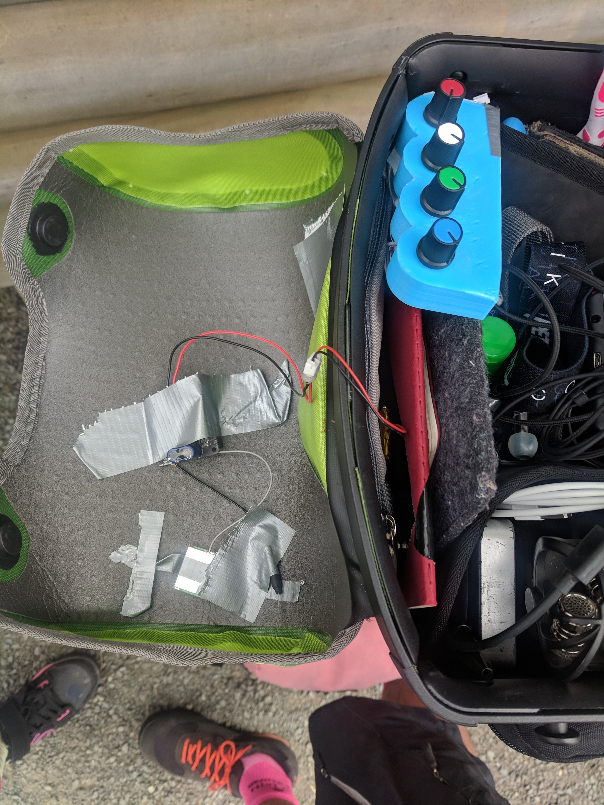
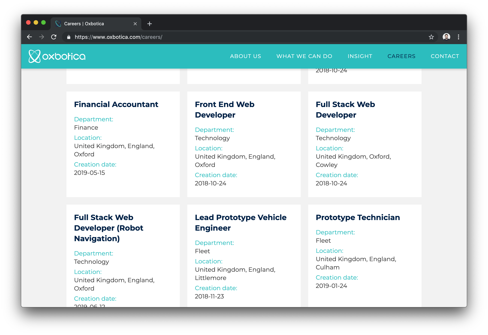
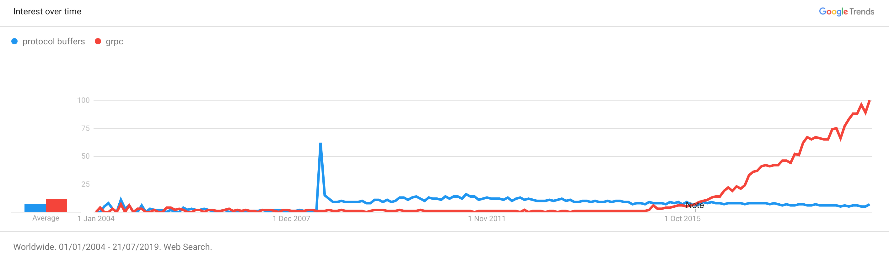
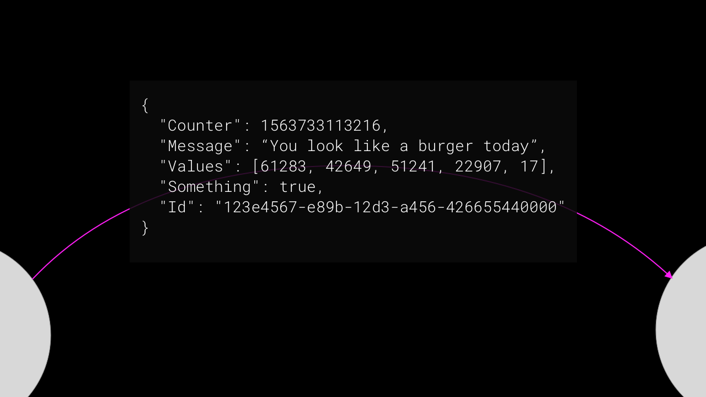
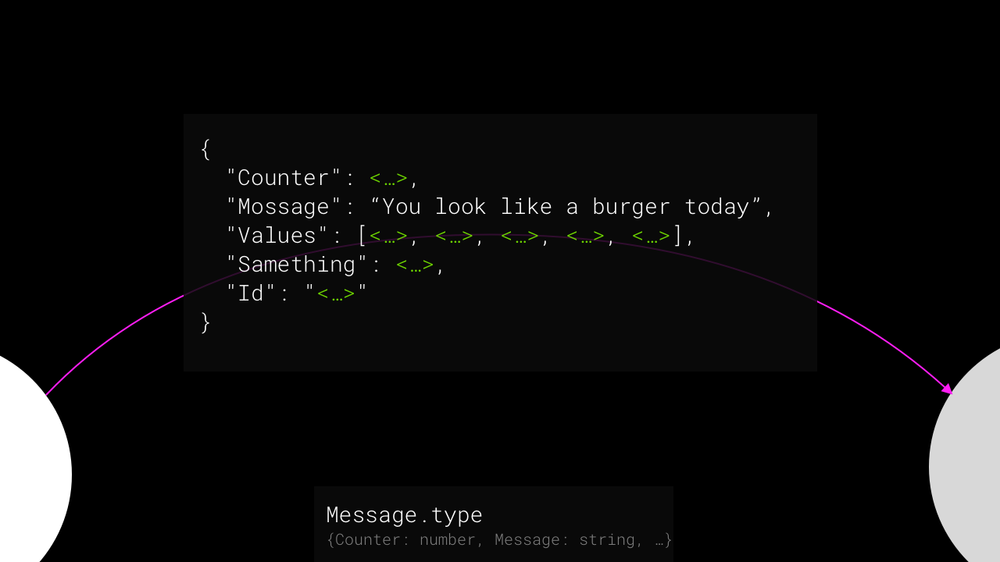

# [fit] Any Questions?

---

# Hi,
# [fit] I'm Ben

# (It's nice to be back)

^ I helped start this Meetup,  which gives me a really unique perspecive giving a talk here.  And from that perspective, one thing I feel really strongly is…

---

# [fit] Seren 
# [fit] & Marcus

# You're doing such a great job 🥰

^ I got a message a couple of months ago asking if I was up for this date, and it almost brought a tear to my eye

---

# 2016 Wrap Up

---

# An Update on the World Of Ben

---

# 2017

# 🎨 Random stuff
# 💸 Investment banking

# 2018

# 🤖 Robot cars
# 🇳🇿New Zealand

[replace with calendar]

---


# Burger with Ryan

---

# New Zealand


---


---



---




---


---




---


---


---


---

# Australia

---

# Vietnam

---

# Oxford

---

# Oxbotica

^ new project, new office

---

[what I'm working on]


---

# Find out more
## → oxbotica.com

---


<!-- ---

 -->

---


---



---

# ~~Hello~~
# Talk Intro

---

# Protocol Buffers & gRPC

# - Not New or Trendy

^ https://trends.google.com/trends/explore?date=all&q=protocol%20buffers




---


---


---


---

# ~~Talk Intro~~

# Protocol Buffers

---

# [fit] JSON

---



---

## Store things better-er

# [fit] 1234567890

```
# JSON
000000  31 32 33 34 35 36 37 38 39 30                    1234567890

# Var Int
000000  d2 85 d8 cc 04                                   Ò.ØÌ.
```


[observablehq.com/@benfoxall/var-int-encoding](https://observablehq.com/@benfoxall/var-int-encoding)

---

## Store things better-er

# [fit] true

```
# JSON encoded
000000  74 72 75 65                                      true

# Var Int (1)
000000  01                                               .
```

---

## Store things better-er

# [fit] 123e4567-e89b-12d3-a456-426655440000

```
# JSON encoded
000000  31 32 33 65 34 35 36 37 2d 65 38 39 62 2d 31 32  123e4567-e89b-12
000010  64 33 2d 61 34 35 36 2d 34 32 36 36 35 35 34 34  d3-a456-42665544
000020  30 30 30 30                                      0000

# Raw bytes
000000  12 3E 45 67 E8 9B 12 D3 A4 56 42 66 55 44 00 00 
000010  B
```

^ TODO - it might be better to to data-uri here

---


---


---


---




---


---


---

# [fit] 🎉 We've 🎉 
# [fit] 🎉 Invented 🎉 
# [fit] 🎉 Protocol Buffers 🎉 

---

# 1. Write a `message.proto` 📝
# 2. Generate `message_pb.js` 🤖
# 3. Use `Message` in your code ✨

---

# ⚡️ Demo

[TODO]

---

# The Good stuff
## [fit] Efficient*

---

# The Good stuff
## [fit] Strongly typed
## [fit] messaging

^ The objects that we've dealt with have been simple, but imagine a huge complex changing object

---

# The Good stuff
## [fit] Strongly typed messaging
## [fit] between languages

```bash
protoc *.proto
  --js-out=… 
  --python-out=…
  --c-out=…
```

---

# The Good stuff
## [fit] Strongly typed messaging
## [fit] between languages
## [fit] idiomatically

---

# The Good stuff
## [fit] Avoids Translation

---

# The Good stuff
## [fit] Transport Agnostic

---

# …

---

# …Though…

---

# …Though…
# [fit] it's a massive faff

---

# …Though…
# [fit] TS interfaces
# [fit] will get you far

---

# …Though…
# [fit] JSON is kind
# [fit] of awesome

```ts
// JS Object
const data = [{name: 'item-1', stuff: [5, 3, 2]……}]

// JSON String
const data = JSON.parse("[{name: 'item-1', stuff: [5, 3, 2]……}]")
```

---

# MISSING

WHY IS IT GOOD TO BE USING THIS IN THE BROWSER

---

# GRPC

---


# [fit] REST

[.background-color: #ffcc00]

---


