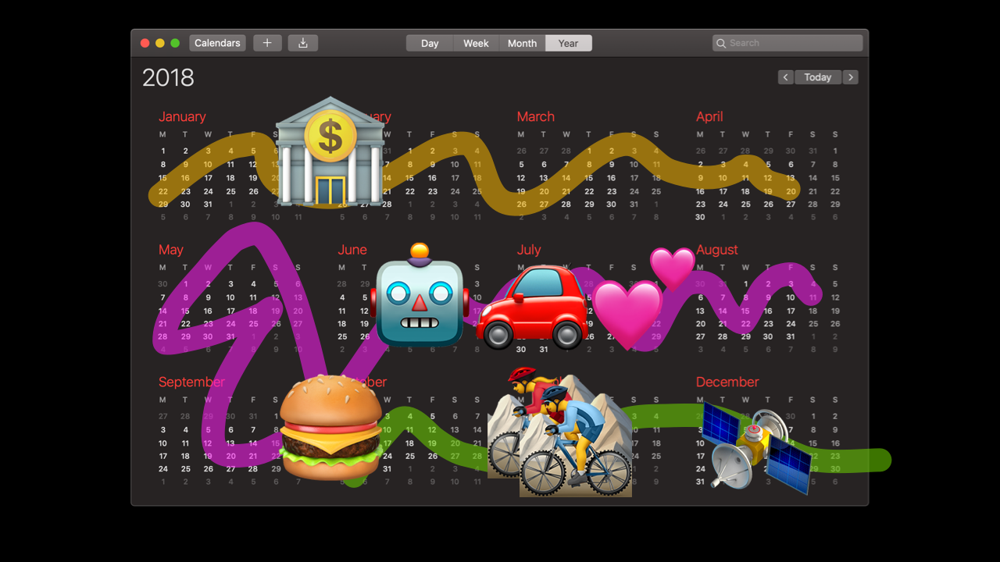
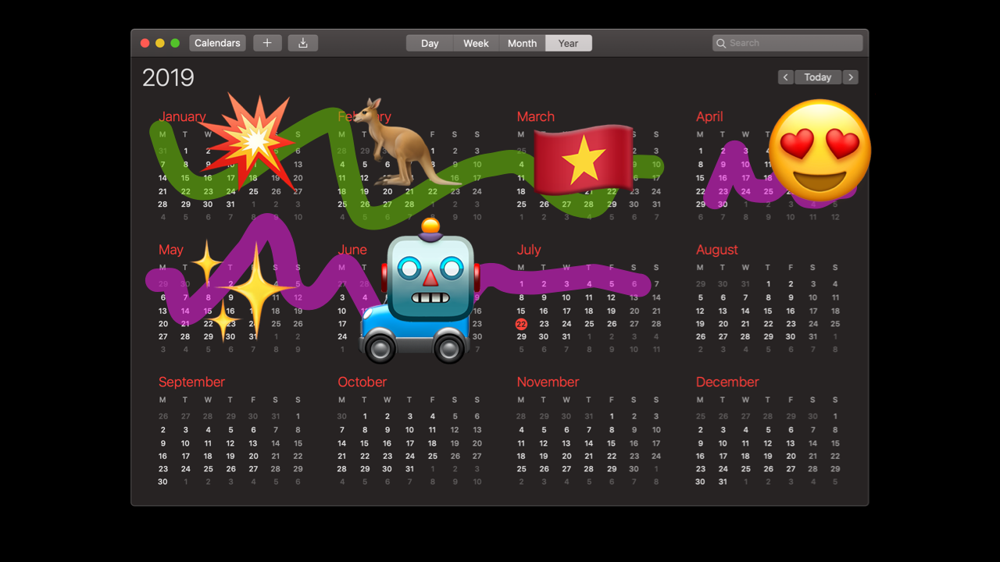
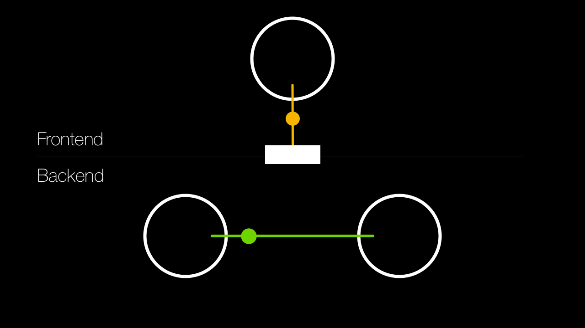
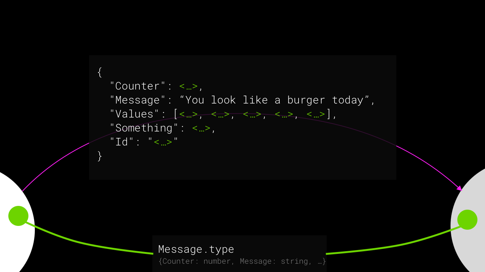
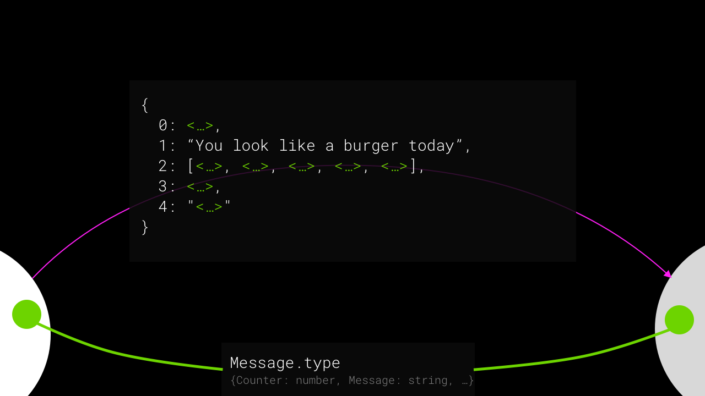

# [fit] Any Questions?

---

# Hi,
# [fit] I'm Ben

# (It's nice to be back)

^ I helped start this Meetup,  which gives me a really unique perspecive giving a talk here.  And from that perspective, one thing I feel really strongly is…

---

# [fit] Seren 
# [fit] & Marcus

# You're doing such a great job 🥰

^ I got a message a couple of months ago asking if I was up for this date, and it almost brought a tear to my eye

---

# 2016 Wrap Up

---

# An Update on the World Of Ben

---


^ Freelance stuff - art gallery

^ Nexmo

---



---


# Burger with Ryan

---


---

# New Zealand


---


---

# GPS Hacks


---

# Stuffometer


---


---


---



---


---


---


---

# Back to Oxbotica 🎉

---


---

# Find out more
## → oxbotica.com

---


<!-- ---

 -->

---


---


---

# ~~Hello~~

---

# Protocol Buffers & gRPC

---

# Not New **or** Trendy

^ https://trends.google.com/trends/explore?date=all&q=protocol%20buffers


---

# Protocol Buffers

## → Serialising Objects

# gRPC

## → Building APIs

---

# Popular & Prolific

---

# Popular & Prolific

## … but not so much in the web

---

# …because with the web

## Serialising Objects → JSON

## Building an API → REST

---

<!--


---

-->



---


---

# [fit] Protocol 
# [fit] Buffers
# and JSON

[.background-color: #ffcc00]

<!---

# getting to
# [fit] Protocol Buffers

# from
# [fit] JSON
-->

---

# JSON → Protocol Buffers

---


---

## Store things better-er

# [fit] 1234567890

```
# JSON
000000  31 32 33 34 35 36 37 38 39 30                    1234567890

# Var Int
000000  d2 85 d8 cc 04                                   Ò.ØÌ.
```


[observablehq.com/@benfoxall/var-int-encoding](https://observablehq.com/@benfoxall/var-int-encoding)

---

## Store things better-er

# [fit] true

```
# JSON encoded
000000  74 72 75 65                                      true

# Var Int (1)
000000  01                                               .
```

---

## Store things better-er

# [fit] 123e4567-e89b-12d3-a456-426655440000

```
# JSON encoded
000000  31 32 33 65 34 35 36 37 2d 65 38 39 62 2d 31 32  123e4567-e89b-12
000010  64 33 2d 61 34 35 36 2d 34 32 36 36 35 35 34 34  d3-a456-42665544
000020  30 30 30 30                                      0000

# Raw bytes
000000  12 3E 45 67 E8 9B 12 D3 A4 56 42 66 55 44 00 00 
000010  B
```

^ TODO - it might be better to to data-uri here

---


---


---


---


---



---



---

# [fit] 🎉 We've 🎉 
# [fit] 🎉 Invented 🎉 
# [fit] 🎉 Protocol Buffers 🎉 

---

# 1. 📝 `message.proto` 
# 2. 🤖 `message_pb.js` 
# 3. ✨ `new Message()`

---

# ⚡️ Demo

---

# The Good stuff

---

# Typed messages across multiple langauges


```bash
protoc example.proto
  --js-out=… 
  --python-out=…
  --c-out=…
```

---

# Avoids translation

```sql
SELECT * FROM todoList WHERE …
```

1. TodoItem model class

2. Rest API Layer

3. fetch(…).then(r => r.json())

4. TodoItem.fromJSON()

5. <Item title={item.title}>

[.build-lists: true]

---

# The Good stuff
## [fit] Transport Agnostic

---

# …

---

# …Though…

---

# …Though…
# [fit] it's a massive faff

---

# …Though…
# [fit] TS interfaces
# [fit] will get you far

---

# …Though…
# [fit] JSON is kind
# [fit] of awesome

```ts
// JS Object
const data = [{name: 'item-1', stuff: [5, 3, 2]……}]

// JSON String
const data = JSON.parse("[{name: 'item-1', stuff: [5, 3, 2]……}]")
```

---

# MISSING

WHY IS IT GOOD TO BE USING THIS IN THE BROWSER

---

# [fit] gRPC

# and REST

[.background-color: #ffcc00]

---
<!--
# RPC

# a function in your code might transparently run somewhere else

---

-->

# Goals

* REST - Modelling state
* gRPC - Calling remote functions

---

# Architectural Models

* REST - Resource Oriented
* gRPC - Service Oriented

---

# REST - Resource Oriented
## Identifier

```
GET /posts/42/comments/15
```

↑ Relates to a resource

---

# gRPC - Service Oriented
## Identifier

```
CommentService/LoadComment
```

↑ Relates to a service method

---

# Interactions

* Request / Response (REST & gRPC)
* Request / Responses (gRPC)
* Requests / Response (gRPC)
* Requests / Responses (gRPC)

[.build-lists: true]

---

# Transport

* REST - HTTP1/HTTP1.1/HTTP2/…
* gRPC - HTTP2

[.build-lists: true]

---

<!--
# Why Only HTTP2


slideshare.net/Enbac29/http2-standard-for-video-streaming

^ you wouldn't want a waterfall when calling functions

---

-->

# [fit] Browser Support 

---

# [fit] Browser Support - REST

# [fit] 100%

---

# [fit] Browser Support – gRPC

# [fit] 0%

---

# gRPC-web [^1]


[^1]: [github.com/grpc/grpc/blob/master/doc/PROTOCOL-WEB.md](https://github.com/grpc/grpc/blob/master/doc/PROTOCOL-WEB.md)

---

# Using gRPC-web today

1. Use grpc-web-proxy
2. Use Envoy Proxy
3. Wait for tomorrow

[.build-lists: true]

---

> In the future, we expect gRPC-Web to be supported in language-specific Web frameworks, such as Python, Java, and Node.

---

# The
# Totally
# Cool
# Awesome
# Thing

----

# gRPC interfaces are typed

```bash
# calculator.proto
service Calculator {
  rpc Add (NumberList) returns (Number);
}


# use grpc plugin
protoc calculator.proto
  --plugin=protoc-gen-grpc=grpc-plugin \
  --grpc_out=.
  

# generated ./calculator_grpc_pb.js
```

---

# Demo

```
service Zoom {

    rpc echo(EchoMessage) returns (EchoMessage);

    rpc systemInfo (Noop) returns (stream SystemInfo);
    
    rpc screenShot (Noop) returns (Image);

    rpc setColorScheme (ColorSchemeRequest) returns (Noop);

}
```

---

## The Good Stuff (for the Web)

* Microservices ↔︎ Components[^*]
* Make IPC a thing – WebAssembly, Workers, etc.
* Avoid siloing


[^*]: https://martinfowler.com/articles/micro-frontends.html

[.build-lists: true]

<!--

---

## Why it feels weird

* The web *is* REST
* JS has been a single language on a platform
* Obfuscation sucks
* We're used to things being fuzzy
* Accessibility 

^ Hypermedia as the engine of application state

<!--

"A REST API should never have “typed” resources"
https://roy.gbiv.com/untangled/2008/rest-apis-must-be-hypertext-driven

-->

---

# Quick summary

* Protocol Buffers
* gRPC


---

[BACKEND]

---

[NO-BACKEND]

---

[DIAGRAM]

[peer] => [peer]

[peerT] => [peerT]

[peerT<S>] => [peerT<S>]

---

# Demo

Zoom Service (Web edition)

---

# Peer RPC

---

# Peer RPC

# Supports a different kind of interaction

---

# Feels good!

```ts
new PeerServiceServer(roomName, Zoom, {
  echo: (req, res) => {
    res.setText(
      req.getText()
    )
  },
  setColorScheme: (req) => {
    document.body.style.background =
      req.isDark() ? '#000' : '#fff'
  }
})
```

---

# Building interfaces

```
service Controller {
  rpc joystick(repeated Move) returns (Noop);
  rpc press(Button) returns (Noop); 
}
```

---

# Summary

* Protocol Buffers
* gRPC
* pRPC

---

# Chat

---

# Thanks

@benjaminbenben

(Seren and Marcus – you're awesome)

